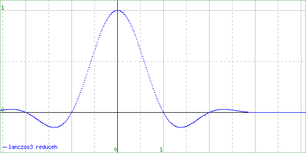
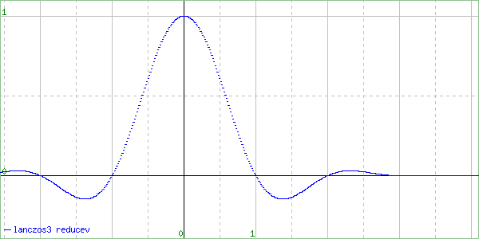
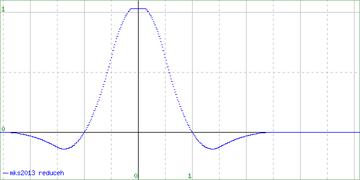
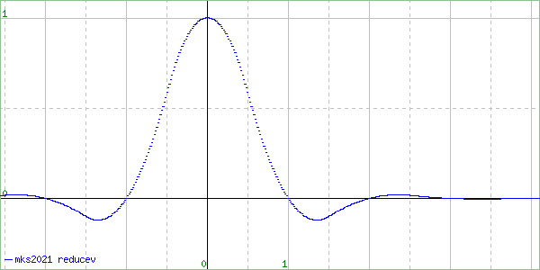

# libvips PR #4237

[ResampleScope](https://entropymine.com/resamplescope/) test case for PR [libvips/libvips#4237](https://github.com/libvips/libvips/pull/4237).

## Run

```console
$ ./resamplescope.sh
```

See [output/](output) directory.

## Output

### lanczos3 (for reference)

#### reduceh



#### reducev



### mks2013

### Reference


#### reduceh



#### reducev


### mks2021

### Reference


#### reduceh


#### reducev


